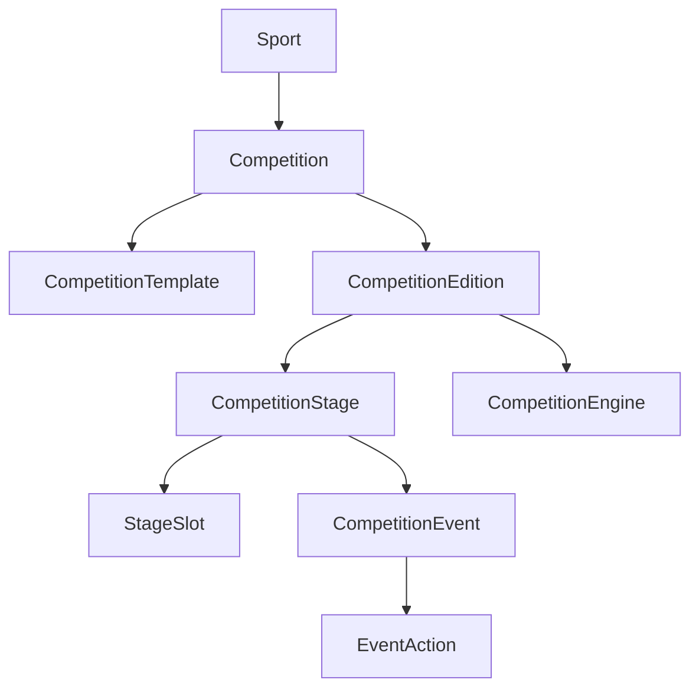

# Sports Engine

> Universal Sports Competition Engine
>
> Version: 0.1.0
>
> Status: Draft

---

# 1. Objetivo

O Sports Engine é uma plataforma para gerenciamento e processamento de competições esportivas.

O projeto foi concebido para permitir que diferentes esportes compartilhem a mesma arquitetura de dados, mantendo suas particularidades apenas nas regras de negócio.

O sistema deve permitir:

- Cadastro de esportes.
- Cadastro de competições.
- Cadastro de temporadas.
- Cadastro de participantes.
- Simulação de campeonatos.
- Processamento de resultados em tempo real.
- Importação de dados históricos.
- Suporte a diferentes níveis de detalhamento das informações.
- Evolução para novos esportes sem necessidade de remodelagem do banco.

O sistema NÃO é específico para futebol.

Ele deve ser capaz de representar, entre outros:

- Futebol
- Futebol Americano
- Basquete
- Vôlei
- Rugby
- Tênis
- Fórmula 1
- Fórmula E
- MotoGP
- WEC
- NASCAR
- IndyCar

---

# 2. Filosofia

A arquitetura foi construída seguindo um conjunto de princípios.

Todos os módulos devem respeitar esses princípios.

Eles são mais importantes do que qualquer decisão técnica.

---

# 3. Princípios Arquiteturais

## 3.1 Source of Truth

Toda informação do sistema deve possuir uma única fonte de verdade.

Exemplos:

O placar de uma partida é fonte de verdade.

A classificação da competição não é.

A classificação pode sempre ser reconstruída.

---

Os eventos são fonte de verdade.

As estatísticas não são.

Exemplo:

```
Gol

Jogador

Minuto

Equipe
```

A quantidade de gols do jogador nunca deve ser considerada a informação principal.

Ela sempre poderá ser calculada novamente.

---

## 3.2 Determinismo

A engine deve ser completamente determinística.

Dado exatamente o mesmo conjunto de dados, ela sempre deverá produzir exatamente o mesmo resultado.

Isso permite:

- corrigir resultados antigos;
- recalcular temporadas;
- atualizar regras;
- reproduzir campeonatos históricos.

---

## 3.3 Reprocessamento

Sempre que um resultado for alterado, toda a edição da competição deverá ser reprocessada.

O sistema nunca deve depender de atualizações incrementais.

Fluxo esperado:

```
Resultado alterado

↓

Persistir alterações

↓

Executar CompetitionEngine

↓

Recalcular classificação

↓

Recalcular estatísticas

↓

Atualizar classificados

↓

Atualizar confrontos

↓

Persistir estado final
```

Mesmo uma Copa do Mundo possui poucos eventos comparada a sistemas tradicionais.

A simplicidade obtida compensa o pequeno custo computacional.

---

## 3.4 Imutabilidade Histórica

Uma edição representa exatamente aquele campeonato.

Mudanças futuras de regulamento nunca alteram temporadas anteriores.

Exemplo:

Brasileirão

1998

↓

mata-mata

Brasileirão

2004

↓

pontos corridos

Ambos coexistem normalmente.

---

## 3.5 Engine Plugável

O banco de dados nunca calcula regras.

Toda regra pertence a uma CompetitionEngine.

Exemplos:

SoccerLeagueEngine

WorldCupEngine

FormulaOneEngine

WECEngine

A API apenas seleciona a engine correta.

---

## 3.6 Estrutura separada das regras

Estrutura da competição e regras da competição são conceitos diferentes.

Estrutura define:

- grupos
- fases
- confrontos
- rodadas

Regras definem:

- pontuação
- critérios de desempate
- classificados
- distribuição de pontos

Essa separação permite reaproveitamento.

---

## 3.7 Dados Incompletos

O sistema deve aceitar qualquer nível de detalhamento.

Exemplo:

Resultado completo

Brasil 3 x 2 Argentina

Gol

Jogador

Assistência

Cartão

Substituições

---

Resultado histórico

Brasil 3 x 2 Argentina

Sem autores dos gols.

Ambos são válidos.

---

## 3.8 Estatísticas Derivadas

Toda estatística deve ser considerada informação derivada.

Exemplos:

- artilharia
- cartões
- assistências
- vitórias
- derrotas
- saldo

No futuro poderão existir tabelas materializadas para performance.

Essas tabelas nunca serão a fonte de verdade.

---

# 4. Visão Geral

A arquitetura é dividida em três camadas.

```
                Competition Engine
                       │
        ┌──────────────┴──────────────┐
        │                             │
Competition Structure         Competition Processing
        │                             │
        └──────────────┬──────────────┘
                       │
                 Persistence Layer
```

---

# 5. Conceitos Fundamentais

Existem alguns conceitos centrais no projeto.

Todos os demais derivam deles.

## Sport

Representa uma modalidade esportiva.

Exemplos:

- Futebol
- Fórmula 1
- Basquete

Um esporte pode possuir diversas competições.

---

## Competition

Representa uma competição permanente.

Exemplos:

- Copa do Mundo
- Campeonato Brasileiro
- Fórmula 1
- WEC

Uma competição nunca representa uma temporada.

---

## Competition Template

Define a estrutura base utilizada por uma edição.

Exemplo:

Copa do Mundo

48 seleções

12 grupos

32 avos

16 avos

Oitavas

Quartas

Semifinal

Final

Outro exemplo:

Brasileirão

20 clubes

38 rodadas

Turno

Returno

Templates podem ser reutilizados por diversas temporadas.

---

## Competition Edition

Representa uma edição específica.

Exemplos:

Brasileirão 2025

F1 2026

Copa do Mundo 2030

Cada edição referencia:

- Competition
- Template
- CompetitionEngine

---

## Competition Stage

Representa uma fase.

Exemplos:

Grupo A

Grupo B

Rodada 12

Quartas

Sprint Weekend

Final

Não existe diferença estrutural entre elas.

Todas são apenas stages.

---

## Stage Slot

Stage Slots representam posições dentro da competição.

Eles NÃO representam participantes.

Exemplos:

Grupo A

Posição 1

Posição 2

Posição 3

Posição 4

Outro exemplo:

Winner Group A

Runner-up Group C

Outro exemplo:

Winner Match 12

Esses slots serão resolvidos pela CompetitionEngine.

Essa decisão elimina praticamente toda a complexidade de geração dos confrontos.

---

## Competition Event

Representa um evento esportivo.

Exemplos:

Partida

Corrida

Sprint

Qualifying

Treino

Cada esporte define seus próprios tipos de eventos.

---

## Event Action

Representa acontecimentos internos de um evento.

Exemplos:

Futebol

- Gol
- Cartão
- Pênalti
- Substituição

F1

- Pit Stop
- Safety Car
- Volta Rápida
- Abandono

WEC

- Troca de Piloto
- Pit Stop

Todos utilizam a mesma estrutura.

---

# 6. Arquitetura Geral



---

# 7. O Papel da CompetitionEngine

A CompetitionEngine é responsável por transformar dados em informação.

Ela nunca cria dados históricos.

Ela apenas interpreta os dados existentes.

Responsabilidades:

- validar estrutura;
- gerar confrontos;
- distribuir participantes;
- calcular classificação;
- calcular estatísticas;
- promover classificados;
- resolver Stage Slots;
- atualizar confrontos futuros.

Cada esporte pode possuir diversas engines.

Exemplos:

SoccerLeagueEngine

SoccerKnockoutEngine

WorldCupEngine

FormulaOneEngine

WECEngine

Uma edição referencia exatamente uma engine.

Isso garante previsibilidade e reprodutibilidade.

---

# 8. Modelo de Domínio

O domínio do Sports Engine é construído em torno de um pequeno conjunto de entidades fundamentais.

Todas as demais entidades existem para descrever como esses objetos interagem ao longo de uma competição.

O princípio adotado é:

> Toda entidade deve representar um conceito do domínio, nunca uma implementação.

Por esse motivo, o sistema não possui entidades como:

- SoccerMatch
- FormulaRace
- FormulaDriver
- FootballTeam

Todos esses conceitos são representados por entidades genéricas.

---

# 9. Participantes

O conceito mais importante do sistema é o **Participant**.

Um participante representa qualquer entidade capaz de competir em algum momento.

Exemplos:

- Clube
- Seleção
- Equipe
- Piloto
- Jogador
- Carro
- Moto
- Barco
- Dupla
- Atleta

Todos são participantes.

A arquitetura não diferencia esses objetos estruturalmente.

Essa decisão permite reutilização entre esportes completamente diferentes.

---

## ParticipantType

Todo participante possui um tipo.

Exemplos:

```
TEAM
CLUB
NATIONAL_TEAM
PLAYER
DRIVER
CAR
BIKE
BOAT
PAIR
ATHLETE
```

O tipo possui apenas finalidade descritiva.

Ele não altera o funcionamento da engine.

As regras continuam sendo responsabilidade da CompetitionEngine.

---

## Identidade

Um participante representa uma identidade permanente.

Exemplos:

Ferrari

Lewis Hamilton

Real Madrid

Brasil

Ferrari #51

Essas entidades existem independentemente de qualquer competição.

Nunca devem possuir referência direta para temporadas.

---

# 10. Relações entre Participantes

Participantes podem possuir relações hierárquicas.

Essas relações também fazem parte do domínio.

Exemplos:

Ferrari

↓

Carro #16

↓

Charles Leclerc

Outro exemplo:

Real Madrid

↓

Jogadores

Outro exemplo:

Ferrari AF Corse

↓

Ferrari #51

↓

Piloto A

↓

Piloto B

↓

Piloto C

---

## ParticipantRelation

As relações são temporais.

Uma relação nunca deve ser permanente.

Ela possui:

- participante pai
- participante filho
- tipo da relação
- data inicial
- data final

Isso permite representar:

- transferências
- troca de pilotos
- empréstimos
- mudanças de equipe
- múltiplos pilotos por carro

---

## Exemplos

### Futebol

```
Real Madrid

↓

Vinicius Junior
```

---

### Fórmula 1

```
Ferrari

↓

Ferrari #16

↓

Charles Leclerc
```

---

### WEC

```
Ferrari AF Corse

↓

Ferrari #51

↓

Pier Guidi

↓

Calado

↓

Giovinazzi
```

---

### Tênis

```
Dupla

↓

Jogador A

↓

Jogador B
```

A engine decide como interpretar essas relações.

---

# 11. Organização das Competições

Uma competição representa um campeonato permanente.

Exemplos:

- Libertadores
- Champions League
- Copa do Mundo
- Campeonato Brasileiro
- Fórmula 1

Ela nunca representa uma temporada.

---

## CompetitionTemplate

O template descreve a estrutura padrão de uma competição.

Ele funciona como um "projeto" utilizado para criar novas temporadas.

Um template pode definir:

- quantidade de participantes
- estrutura das fases
- rodadas
- confrontos
- critérios de classificação esperados
- parâmetros utilizados pela engine

Exemplo:

```
Brasileirão

20 clubes

38 rodadas

Turno e Returno
```

Outro exemplo:

```
Copa do Mundo

48 seleções

12 grupos

32 avos

16 avos

Oitavas

Quartas

Semifinal

Final
```

Um template pode possuir diversas versões.

Mudanças de regulamento resultam em novos templates.

Nunca em alterações do template anterior.

---

# 12. CompetitionEdition

Representa uma temporada específica.

Exemplos:

```
Brasileirão 2025

World Cup 2026

Formula One 2027
```

Uma edição referencia:

- Competition
- CompetitionTemplate
- CompetitionEngine

Ela também possui:

- data inicial
- data final
- status
- configuração específica

---

## Estados possíveis

Uma edição pode estar:

```
PLANNED

IN_PROGRESS

FINISHED

CANCELLED
```

---

# 13. Participação na Competição

Participar de uma competição é diferente de existir.

Por esse motivo existe a entidade CompetitionEntry.

Ela representa uma inscrição.

Exemplo:

Lewis Hamilton existe.

Sua participação na Fórmula 1 de 2026 é uma inscrição.

Da mesma forma:

Brasil existe.

Sua participação na Copa do Mundo de 2030 também é uma inscrição.

---

CompetitionEntry permite:

- entrada tardia
- abandono
- suspensão
- desclassificação
- substituições

Sem alterar a identidade do participante.

---

# 14. CompetitionStage

Stages representam as fases de uma competição.

Exemplos:

Grupo A

Grupo B

Rodada 15

Oitavas

Quartas

Sprint Weekend

Final

A arquitetura não diferencia esses conceitos.

Todos são apenas stages.

---

## Hierarquia

Stages podem possuir sub-stages.

Exemplo:

```
Fase de Grupos

├── Grupo A

├── Grupo B

├── Grupo C

└── Grupo D
```

Outro exemplo:

```
Playoffs

├── Quartas

├── Semifinal

└── Final
```

Essa estrutura é completamente genérica.

---

# 15. StageSlot

StageSlot representa posições.

Nunca participantes.

Essa entidade é responsável por tornar a geração dos confrontos totalmente genérica.

Exemplos:

```
Grupo A

Posição 1

Posição 2

Posição 3

Posição 4
```

Outro exemplo:

```
Winner Group A

Runner-up Group C
```

Outro exemplo:

```
Winner Match 12
```

Slots são resolvidos pela CompetitionEngine.

---

## Benefícios

Sem StageSlot seria necessário atualizar dezenas de confrontos manualmente.

Com StageSlot basta resolver o slot.

Automaticamente todos os confrontos futuros passam a conhecer o participante correto.

Essa é uma das entidades centrais da arquitetura.

---

# 16. CompetitionEvent

Representa um evento esportivo.

Exemplos:

Partida

Corrida

Sprint

Qualifying

Treino

A arquitetura nunca assume que um evento é uma partida.

Cada esporte define seus próprios tipos.

---

## Participantes

CompetitionEvents não conhecem diretamente participantes.

Eles conhecem StageSlots.

Exemplo:

```
Home Slot

Away Slot
```

Ou

```
Grid Position 1

Grid Position 2
```

A engine resolve os slots para participantes concretos.

---

# 17. Locais

Eventos podem ocorrer em locais.

Exemplos:

- estádio
- autódromo
- arena
- circuito urbano
- ginásio

Esses locais são representados por uma entidade genérica (Venue), vinculada a uma localização geográfica.

Ela pode armazenar informações permanentes do local, independentemente das competições realizadas.

---

# 18. Níveis de Qualidade dos Dados

Nem todas as competições possuem o mesmo nível de informação.

O sistema deve suportar isso explicitamente.

Sugere-se uma classificação semelhante a:

```
RESULT_ONLY

BASIC_EVENTS

FULL_EVENTS

DETAILED_STATS
```

### RESULT_ONLY

Apenas resultado final.

### BASIC_EVENTS

Resultado mais acontecimentos principais.

Exemplo:

- gols
- cartões

### FULL_EVENTS

Todos os acontecimentos relevantes.

### DETAILED_STATS

Informações avançadas.

Exemplos:

- posse de bola
- xG
- velocidade média
- telemetria
- setores
- pneus

Esse nível é apenas informativo.

A ausência de dados nunca impede o funcionamento da engine.

---

# 19. Competition Engine

A CompetitionEngine é o componente responsável por interpretar os dados armazenados e transformar eventos em resultados competitivos.

Ela representa o comportamento de uma competição.

O banco de dados não possui regras de negócio.

Toda lógica de:

- pontuação;
- classificação;
- desempates;
- progressão;
- eliminação;
- distribuição de pontos;
- geração de fases;

é responsabilidade da CompetitionEngine.

---

# 20. Responsabilidades da Engine

Uma CompetitionEngine deve ser capaz de:

## Inicialização

Criar a estrutura inicial de uma edição.

Exemplos:

Criar grupos:

```
Grupo A

Grupo B

Grupo C
```

Criar rodadas:

```
Rodada 1

Rodada 2

Rodada 3
```

Criar fases eliminatórias:

```
Oitavas

Quartas

Semifinal

Final
```

---

## Validação

Garantir que a competição está consistente.

Exemplos:

- quantidade correta de participantes;
- fases válidas;
- confrontos possíveis;
- regras compatíveis.

---

## Processamento

Interpretar eventos.

Exemplo futebol:

```
Resultado:

Brasil 2 x 1 Argentina
```

A engine transforma isso em:

```
Brasil +3 pontos

Argentina +0 pontos

Saldo de gols atualizado

Classificação recalculada
```

---

## Progressão

Resolver próximas fases.

Exemplo:

```
Grupo A

1º Brasil

2º Japão
```

Produz:

```
Oitavas

Brasil x Runner-up Grupo C
```

---

# 21. Interface Conceitual

A implementação pode variar, mas conceitualmente uma engine possui responsabilidades semelhantes:

```java
interface CompetitionEngine {

    void initialize(CompetitionEdition edition);

    void validate(CompetitionEdition edition);

    void processEvent(CompetitionEvent event);

    void recalculate(CompetitionEdition edition);

    void resolveNextStages(CompetitionEdition edition);

}
```

A implementação real dependerá da linguagem utilizada.

O domínio não depende disso.

---

# 22. Exemplos de Engines

## Soccer League Engine

Usada em campeonatos de pontos corridos.

Responsabilidades:

- calcular pontos;
- ordenar classificação;
- aplicar desempates;
- determinar campeão.

Exemplo:

```
Vitória = 3 pontos

Empate = 1 ponto

Derrota = 0 pontos
```

---

## World Cup Engine

Usada em competições com grupos e mata-mata.

Responsabilidades:

- distribuir grupos;
- calcular classificação;
- determinar classificados;
- criar confrontos eliminatórios;
- resolver vencedores.

---

## Formula One Engine

Responsabilidades:

- processar corridas;
- distribuir pontos;
- calcular campeonato de pilotos;
- calcular campeonato de construtores.

Exemplo:

Uma corrida gera:

```
Piloto A

+
Equipe A

+
Carro A
```

dependendo das regras da competição.

---

## WEC Engine

Possui diferenças importantes.

O participante principal pode ser o carro.

Exemplo:

```
Carro #51

↓

Piloto A

Piloto B

Piloto C
```

A pontuação pode pertencer ao carro.

Não necessariamente à equipe.

---

# 23. Fluxo de Processamento

Toda alteração segue o mesmo fluxo.

```
Novo resultado

↓

Salvar CompetitionEvent

↓

Salvar EventActions

↓

Executar CompetitionEngine

↓

Recalcular estado da competição

↓

Resolver StageSlots

↓

Atualizar próximos eventos

↓

Disponibilizar resultados
```

---

# 24. Atualização em Tempo Real

O sistema suporta campeonatos em andamento.

Exemplo:

Copa do Mundo 2026.

Antes do campeonato:

```
Grupo A

Slot 1

Slot 2

Slot 3

Slot 4
```

Após sorteio:

```
Brasil

Japão

Alemanha

México
```

Após cada partida:

```
Brasil 2 x 1 Japão
```

A engine atualiza:

- classificação;
- estatísticas;
- próximos confrontos.

---

# 25. Correção de Dados

O sistema não possui atualização incremental obrigatória.

Exemplo:

Resultado cadastrado:

```
Brasil 2 x 1 Japão
```

Depois corrigido:

```
Brasil 1 x 2 Japão
```

Fluxo:

```
Alterar resultado

↓

Executar recálculo

↓

Nova classificação gerada
```

Não existe necessidade de descobrir quais tabelas precisam ser corrigidas.

---

# 26. Estatísticas

Estatísticas são informações derivadas.

Exemplos:

Futebol:

- gols;
- assistências;
- cartões;
- vitórias;
- saldo.

Corridas:

- pontos;
- posições;
- voltas rápidas;
- abandonos.

---

## Materialização

Inicialmente:

```
calcular on demand
```

Futuramente:

```
EventActions

↓

Statistics Builder

↓

Statistics Table
```

As tabelas estatísticas funcionam como cache.

Nunca como fonte principal.

---

# 27. Dados Históricos

O sistema deve aceitar dados históricos incompletos.

Exemplo:

Copa de 1930:

```
Brasil 4 x 1 Bolívia
```

Pode não possuir:

- autores dos gols;
- escalações;
- cartões.

Ainda assim:

- classificação funciona;
- resultados funcionam;
- estatísticas disponíveis são calculadas.

---

# 28. Simulações

Uma simulação é uma CompetitionEdition normal.

Não existe diferença estrutural.

Exemplo:

Usuário cria:

```
Copa do Mundo Alternativa 2030
```

Define resultados:

```
Brasil 3 x 0 Alemanha
```

A engine processa normalmente.

Isso permite:

- previsões;
- cenários;
- testes;
- jogos simulados.

---

# 29. Organizações

Uma competição pode pertencer a uma organização.

Exemplos:

```
FIFA

 └── World Cup


UEFA

 └── Champions League


CONMEBOL

 └── Libertadores


FIA

 └── Formula One
```

Organizações também podem possuir hierarquia.

Exemplo:

```
FIFA

 └── CONMEBOL

      └── CBF
```

---

# 30. Decisões Arquiteturais

## ADR-001

### Dados derivados não são fonte de verdade

Decisão:

Todas as estatísticas e classificações devem poder ser reconstruídas.

Motivo:

Evitar inconsistências.

---

## ADR-002

### Engines são responsáveis pelas regras

Decisão:

O banco armazena dados.

O código interpreta regras.

Motivo:

Permitir múltiplos formatos.

---

## ADR-003

### StageSlots representam posições futuras

Decisão:

Eventos futuros não apontam diretamente para participantes.

Eles apontam para slots.

Motivo:

Permitir geração dinâmica de confrontos.

---

## ADR-004

### Reprocessamento completo

Decisão:

Alterações causam recálculo completo da edição.

Motivo:

Garantir determinismo.

---

# 31. Roadmap

## Fase 1

Fundação:

- entidades principais;
- PostgreSQL;
- API base.

---

## Fase 2

Primeiras engines:

- campeonato pontos corridos;
- grupos + mata-mata.

---

## Fase 3

Eventos:

- gols;
- cartões;
- estatísticas.

---

## Fase 4

Automobilismo:

- F1;
- WEC.

---

## Fase 5

Importadores:

- APIs externas;
- dados históricos.

---

## Fase 6

Frontend:

- dashboards;
- tabelas;
- simulações;
- acompanhamento ao vivo.

---

# 32. Conclusão

O Sports Engine é construído com uma arquitetura orientada a domínio.

A premissa principal é:

> O sistema deve armazenar fatos e permitir que regras transformem esses fatos em resultados.

Essa abordagem permite suportar:

- esportes diferentes;
- formatos diferentes;
- temporadas diferentes;
- dados históricos incompletos;
- campeonatos em andamento;
- simulações futuras.

A arquitetura evita dependência de um esporte específico e permite evolução contínua sem grandes alterações estruturais.